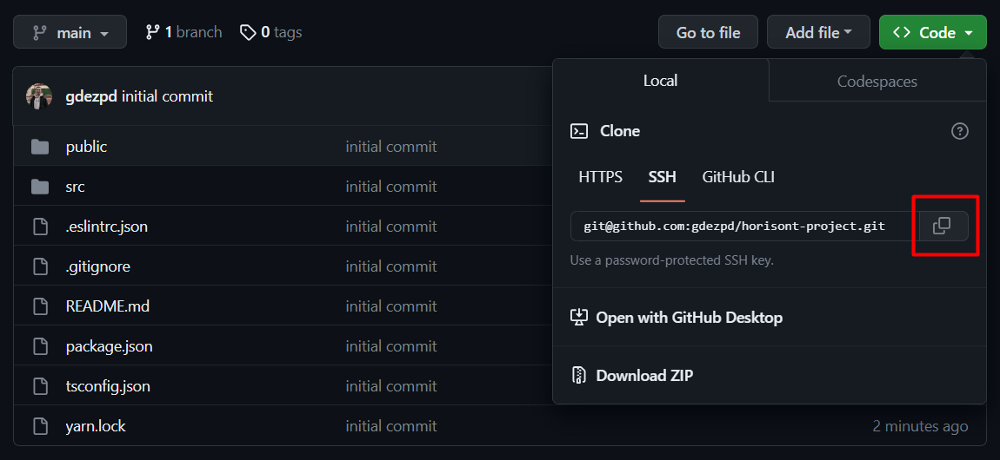
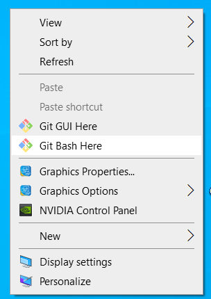
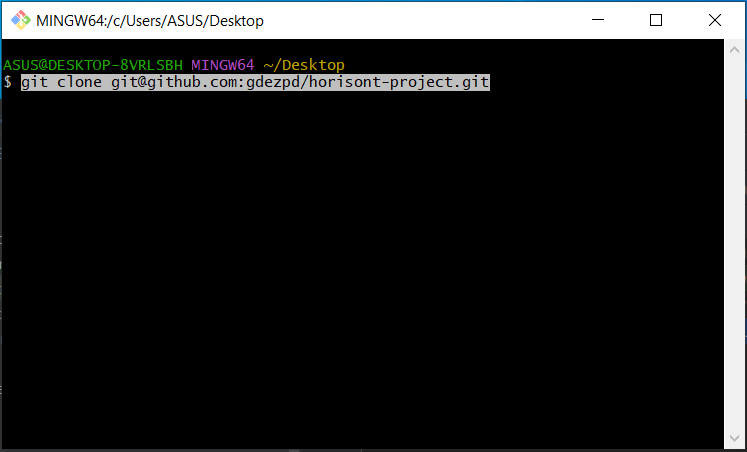
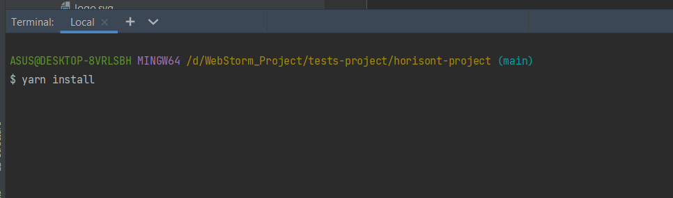
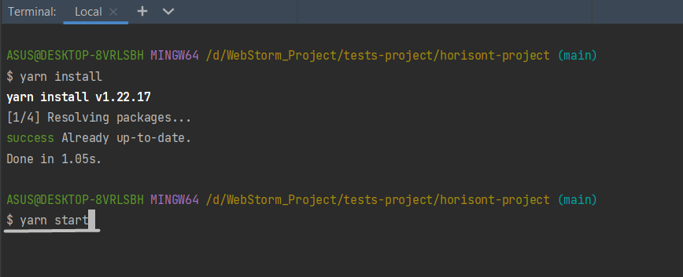

Для запуска данного проекта необходимо выполнить следующие действия:
1) скопируйте SSH ссылку  
2) откройте терминал Git Bash Here(или другой, какой вы используте)  и впишите в командную строку "git clone git@github.com:gdezpd/horisont-project.git" 
3) откройте проект в среде разработки где вы работатете и в терминале напишите команду "yarn install"( если у вас не установлен yarn, попробуйте команду "npm install") 
5) впишите команду "yarn start" 
Happy hacking! 
